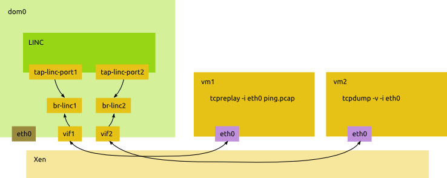

This is a journal of performance testing on LINC switch first on Erlang/OTP
platform, then on LING.

----[25/12/13 18:40]------------------------------------------------------------

We took the performance testing setup described in "Cost, Performance &
Flexibility in OpenFlow: Pick Three" paper. The setup is shown on a picture:

Note: the ping.pcap packet has a checksum field set to 0. This makes it
unsuitable for testing as it gets discarded soon. A new ping.pcap recorded.

The testbed network should function in two modes: 1. vms has Internet
connectivity, ip forwarding is on in Dom0; 2. no ip forwarding, the only way for
vms to talk to each other is through the LINC switch. The mode 1. mostly needed
for installing new packages to Linuxes inside vms. Performance testing uses mode
2.

----[26/12/13 04:33]------------------------------------------------------------

A script called setup-network.sh has been added to switch between modes 1 and 2.

Two flows were added to LINC switch using controllers messages similar to
FlowMod described in the Ping demo document. Each message must have unique xid
and cookie or it is ignored by the switch.

It was double verified that it is the switch that provides the connectivity
between vms. The first run of iperf gives the first performance figure for
LINC/BEAM for the described setup - 140Mbits/s.

----[26/12/13 17:05]------------------------------------------------------------

Repeating the runs gives gradually decreasing throughtput. The controller process
consumes a lot of memory. It looks like the switch send all packets to the
controller for inspection. Flows must be configured differently?

----[27/12/13 03:17]------------------------------------------------------------

The iperf test setup added as a scenario to of_controller_v4.erl. The scenario
first removes all data flow then adds two flows from port 1 to port 2 and back.
New tests confirm the poor throughput observed earlier - 140Mbits/s. The
possible cause is the latency of 1.5ms that affects TCP throughput.

I have to start with the following (not spectacular) baseline.

## LINC/BEAM performance baseline

The following table summarize the performance of LINC switch running on Erlang/OTP.

Parameter | Value
----------|------
Throughput | 140Mbits/s
Latency | 1.4ms
RAM footprint | 450M
CPU utilization | 220%

### Steps to reproduce

1. Create two virtual machines, setup bridges as shown on the picture.
2. Run scripts/setup-network.sh perf
3. Start LINC with 'make devx'
4. Run scripts/setup-network.sh taps
5. Run cd scripts; of_controller_v4.sh -s simple_iperf_test
6. Exit the controller shell
7. Run 'iperf -s' in one vm and 'iperf -c <ip-addr>' in the other

